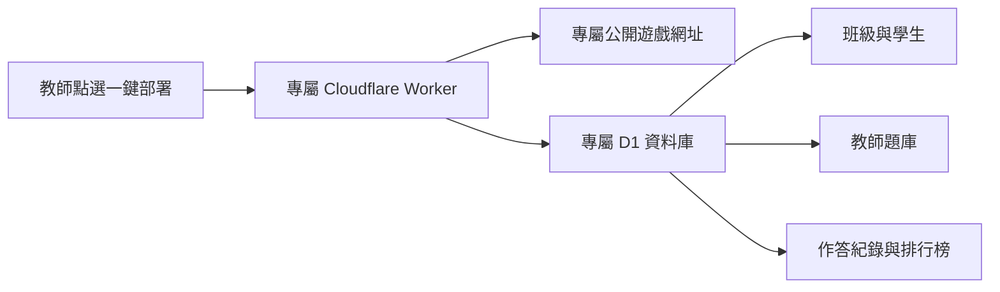

# 經典文學闖關島｜教師獨立部署版

這是一套可讓教師自行部署、管理班級、學生、題庫與作答紀錄的文學闖關遊戲。每位教師部署後都會獲得自己的公開遊戲網址與獨立 Cloudflare D1 資料庫；不同教師之間不共用學生或題庫資料。

[線上示範](https://jingdian-wenxue-islands.jingdian-games-7388.workers.dev/)　｜　[中文部署說明](docs/教師部署圖文說明.md)　｜　[日常管理說明](docs/教師日常管理.md)

> 分享者：請先將下方 `YOUR_GITHUB_ACCOUNT` 改為實際 GitHub 帳號，再將本資料夾上傳為公開程式庫。完成後，其他老師即可使用按鈕部署。

## 每位老師會得到什麼？

- 學生使用「班級代碼＋座號＋PIN」登入，不需要 ChatGPT 帳號。
- 教師使用部署時自行設定的帳號與密碼進入管理端。
- 每套部署的資料完全獨立。
- 支援 Excel 題庫與學生名單匯入、作答紀錄匯出及五島排行榜。
- 玩家可在設定頁修改 2～10 字暱稱，既有分數、配件與作答紀錄不受影響。
- 同一玩家同時只能在一台裝置登入；改用新裝置登入會使舊裝置自動登出，遊戲進度仍保留。
- 支援手機直式操作。

## 教師部署前需要

1. 一個 Cloudflare 帳號。
2. 一個 GitHub 帳號。
3. 自行設定的教師帳號（4～50 個字元，不可有空白）。
4. 自行設定的教師密碼（至少 6 位純數字）。

完整步驟請開啟 [教師部署圖文說明](docs/教師部署圖文說明.md)，或直接雙擊壓縮包內的 `教師部署圖文說明.html`。

## 技術資訊

- Cloudflare Workers
- Cloudflare D1（每位教師獨立建立）
- Next.js／React／Vinext
- TypeScript

本範本不包含任何既有學生、班級、題庫、作答紀錄、Cloudflare API Token、教師密碼、Cloudflare Account ID、D1 Database ID 或 ChatGPT Sites 專案 ID。
