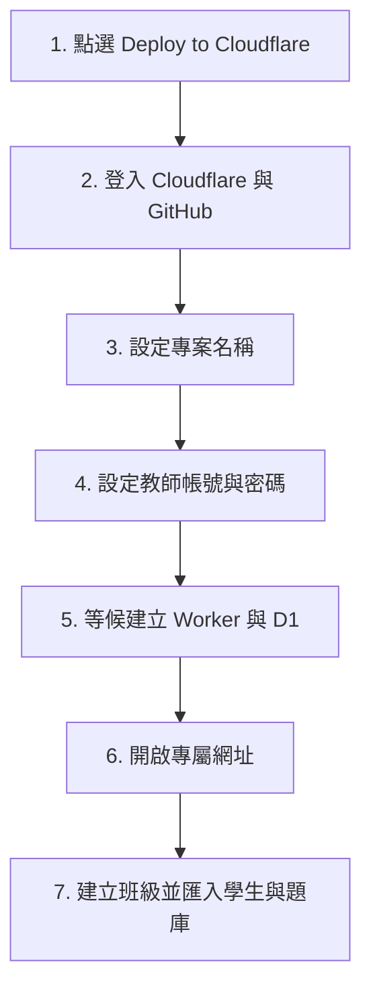

# 教師部署圖文說明

完成一次部署後，您會得到自己的遊戲網址、教師管理端與獨立資料庫。其他老師的資料不會出現在您的系統中。

## 第一步：點選一鍵部署

回到專案首頁，點選藍色的 **Deploy to Cloudflare** 按鈕。

如果按鈕無法使用，代表分享者尚未把 GitHub 網址改成正式網址，請向分享者索取正確連結。

## 第二步：登入帳號

依畫面登入自己的 GitHub 與 Cloudflare 帳號。請務必選擇「自己的 Cloudflare 帳戶」，不要使用其他教師的帳戶。

## 第三步：設定專案

建議名稱使用英文小寫、數字及連字號，例如：

`jingdian-islands-wang-teacher`

每位教師都應使用不同名稱，避免同一 Cloudflare 帳戶中名稱重複。

## 第四步：設定教師登入資料

部署畫面會要求以下 Secret：

| 名稱 | 填寫內容 |
|---|---|
| `TEACHER_USERNAME` | 4～50 個不含空白的字元 |
| `TEACHER_PASSWORD` | 至少 6 位純數字 |

這兩個值是第一次登入教師管理端使用的帳號密碼。請自行保存，不要傳給學生。

## 第五步：完成部署

Cloudflare 會自動建立：

- 一個專屬 Worker。
- 一個專屬 D1 資料庫。
- 一個公開的 `workers.dev` 網址。

部署流程也會自動套用 `drizzle` 資料夾中的 D1 遷移，建立班級、學生、題庫、作答紀錄與單一登入保護所需的資料表及索引。

第一次開啟教師端時，系統會在自己的資料庫建立必要資料表。這不會讀取示範站或其他教師的資料。

## 第六步：登入教師端

1. 開啟部署完成後顯示的網址。
2. 點選學生登入頁下方的「教師管理端」。
3. 輸入部署時設定的教師帳號與密碼。
4. 登入後會先看到「帳號安全」，可立即更換帳密。

## 第七步：建立教學資料

建議依此順序：

1. 在「班級與學生」建立班級。
2. 匯入學生名單，為每位學生設定座號與 PIN。
3. 在「題庫匯入」上傳正式題庫 Excel。
4. 自己先用測試學生登入完成一個關卡。
5. 回到「作答總覽」確認紀錄與 Excel 匯出正常。
6. 將遊戲網址、班級代碼與個別 PIN 提供給學生。

## 第八步：確認玩家設定與登入保護

1. 用一組測試學生帳號登入。
2. 到「設定」修改 2～10 字暱稱，確認地圖與排行榜名稱同步更新。
3. 在另一台裝置使用相同帳號登入，確認原裝置會在操作、切回頁面或最遲約 30 秒內要求重新登入。
4. 確認新裝置仍保有原本的最高分、配件與作答紀錄。

## 常見問題

### 學生需要 ChatGPT 帳號嗎？

不需要。學生只需班級代碼、座號與 PIN。

### 我會看到其他教師的學生嗎？

不會。每次獨立部署都會建立自己的 D1 資料庫。

### 更新程式會清空資料嗎？

只要更新原本的 Worker，並保留原 D1 綁定，就不會清空。不要為了更新而再次建立另一套全新部署。

### 可以讓多位學生共用同一組帳號嗎？

不建議，也不能同時使用。同一帳號只保留最新裝置的登入階段；請為每位學生匯入不同座號與 PIN。

### 忘記首次教師密碼怎麼辦？

若尚未成功登入過，可到 Cloudflare Worker 的 **Settings → Variables and Secrets** 修改 `TEACHER_PASSWORD`。若已完成首次登入，帳密已存入 D1，請依 [版本更新與備份](版本更新與備份.md) 的救援說明處理。
